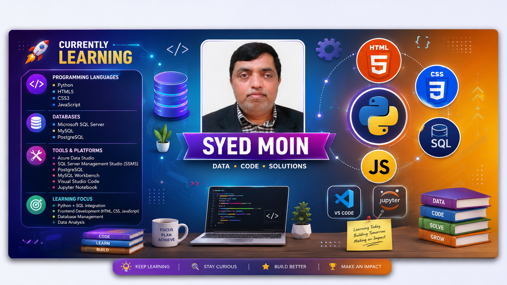

# Hi 👋 I'm Syed Moinuddin

### HR Operations Professional | Data Analyst | Python Developer | SQL Developer | Frontend Developer

---

# 💫 About Me

I'm an **HR Operations Professional** with over **6 years of experience** in HR Administration, Office Operations, Employee Documentation, and Process Management.

My passion for technology inspired me to transition into **Data Analytics**, **Automation**, and **Frontend Development**.

I enjoy solving business problems through data and building efficient solutions using modern technologies.

### 💼 My Focus

- 📊 Data Analytics
- 🐍 Python Programming
- 🛢 SQL Server & PostgreSQL
- 📈 Power BI Dashboards
- 🌐 HTML, CSS & JavaScript
- ⚙ HR Process Automation
- 🚀 Continuous Learning

---

# 🚀 Current Goals

- 🌱 Master Python for Data Analytics
- 🌱 Become Advanced SQL Developer
- 🌱 Learn Advanced JavaScript
- 🌱 Build Real World Data Projects
- 🌱 Develop HR Automation Solutions
- 🌱 Contribute to Open Source

---

# 🛠 Tech Stack

## 👨‍💻 Programming

---

## 🗄 Database

---

## 📊 Data Analytics

---

## ⚙ Developer Tools

---

# 📊 GitHub Dashboard

---
 
 
 
 # 🌟 Featured Projects

> Here are some of my favorite projects that demonstrate my skills in **Python, SQL, Data Analytics, Power BI, and Frontend Development**.

| 🚀 Project | 🛠 Tech Stack | 🔗 Repository |
|------------|--------------|---------------|
| 🍎 Apple Store Analysis | Python, Pandas | [View Project](https://github.com/Syed-Moinuddin2025/python_projects_analyses/tree/main/01_Apple_Store_Analysis) |
| 🪔 Diwali Sales Analysis | Python, Data Cleaning | [View Project](https://github.com/Syed-Moinuddin2025/python_projects_analyses/tree/main/02_Diwali_Sales_Analysis) |
| 🛒 Blinkit Analysis | Python, EDA | [View Project](https://github.com/Syed-Moinuddin2025/python_projects_analyses/tree/main/03_Blinkit_Analysis) |
| 🛍 E-Commerce Sales Analysis | Excel, Python | [View Project](https://github.com/Syed-Moinuddin2025/python_projects_analyses/tree/main/04_Ecommerce_Sales_Analysis) |
| 🍕 Pizza Sales Dashboard | SQL, Power BI | [View Project](https://github.com/Syed-Moinuddin2025/python_projects_analyses/tree/main/05_Pizza_Sales_Analysis) |
| 🍽 Zomato Data Cleaning | Python | [View Project](https://github.com/Syed-Moinuddin2025/python_projects_analyses/tree/main/06_Zomato_Clean_Project) |
| 🎬 Netflix Data Analysis | Python | [View Project](https://github.com/Syed-Moinuddin2025/python_projects_analyses/tree/main/07_Netflix_Data_Analysis) |
| 🚖 Uber Trip Analysis | Python | [View Project](https://github.com/Syed-Moinuddin2025/python_projects_analyses/tree/main/08_Uber%20Data%20Analysis%20Project) |
| ☕ Coffee Shop Sales | Power BI | [View Project](https://github.com/Syed-Moinuddin2025/python_projects_analyses/tree/main/09_Coffee_Shop_Sales_Analysis) |
| ✈ Flight Performance Analysis | Python, SQL | [View Project](https://github.com/Syed-Moinuddin2025/python_projects_analyses/tree/main/10_Flight_Performance_Analysis) |

---

# 📚 Learning Journey

I strongly believe in **continuous learning** and consistently improve my skills through hands-on projects and practical implementation.

## 🐍 Python Development

- Python Fundamentals
- Object-Oriented Programming (OOP)
- File Handling
- Automation Scripts
- Data Analysis with Pandas & NumPy
- Data Visualization

🔗 Repository

https://github.com/Syed-Moinuddin2025/python_Journey

---

## 🛢 SQL Development

- SQL Basics
- Joins
- Subqueries
- CTEs
- Window Functions
- Stored Procedures
- Query Optimization

🔗 Repository

https://github.com/Syed-Moinuddin2025/sql-learning-journey

---

## 🐘 PostgreSQL

- Database Design
- Complex Queries
- Functions
- Views
- Constraints

🔗 Repository

https://github.com/Syed-Moinuddin2025/SQL-Basics-for-All

---

## 🌐 HTML5

Learning modern semantic HTML to build clean and accessible web pages.

Topics:

- Semantic HTML
- Forms
- Tables
- Accessibility
- SEO Basics

---

## 🎨 CSS3

Learning responsive and modern UI development.

Topics:

- Flexbox
- Grid
- Responsive Design
- Animations
- Transitions

---

## ⚡ JavaScript

Building interactive web applications.

Topics:

- Variables
- Functions
- DOM Manipulation
- Events
- ES6+
- Fetch API
- Async JavaScript

---

# 🌱 Currently Learning

- 🤖 Python Automation
- 📊 Advanced Data Analytics
- 🛢 Advanced SQL
- 🐘 PostgreSQL
- 🌐 HTML5
- 🎨 CSS3
- ⚡ JavaScript
- ⚛ React.js (Next Target)
- 📈 Power BI
- ☁ Git & GitHub Best Practices

---

# 🤝 Open Source Goals

I enjoy collaborating on projects related to:

- Data Analytics
- Python
- SQL
- Power BI
- HR Automation
- Web Development
- Open Source Projects

Feel free to connect with me if you're working on something exciting!

---
# 🏆 GitHub Achievements

---

# 📈 Contribution Graph

---

# 📊 Profile Views

---

# 🤝 Let's Connect

---

# 💼 Professional Philosophy

> **"Technology becomes truly powerful when it solves real business problems."**

I believe in combining **HR expertise**, **Data Analytics**, and **Software Development** to create practical solutions that improve productivity, simplify workflows, and support smarter business decisions.

---

# 🚀 2026 Roadmap

- ✅ Become an Advanced Python Developer
- ✅ Master SQL & PostgreSQL
- ✅ Build End-to-End Data Analytics Projects
- ✅ Develop HR Automation Tools
- ✅ Learn React.js
- ✅ Build Full-Stack Web Applications
- ✅ Contribute to Open Source
- ✅ Grow as a Data Analyst

---

# 💡 Quote I Live By

> **"Keep Learning. Keep Building. Keep Growing."**

---

### ⭐ If you like my work, consider giving a star to my repositories!

Thank you for visiting my profile ❤️

# 💡 Fun Fact

> I started learning programming to automate repetitive HR tasks... and today I'm building complete data analytics and web development projects. 🚀
